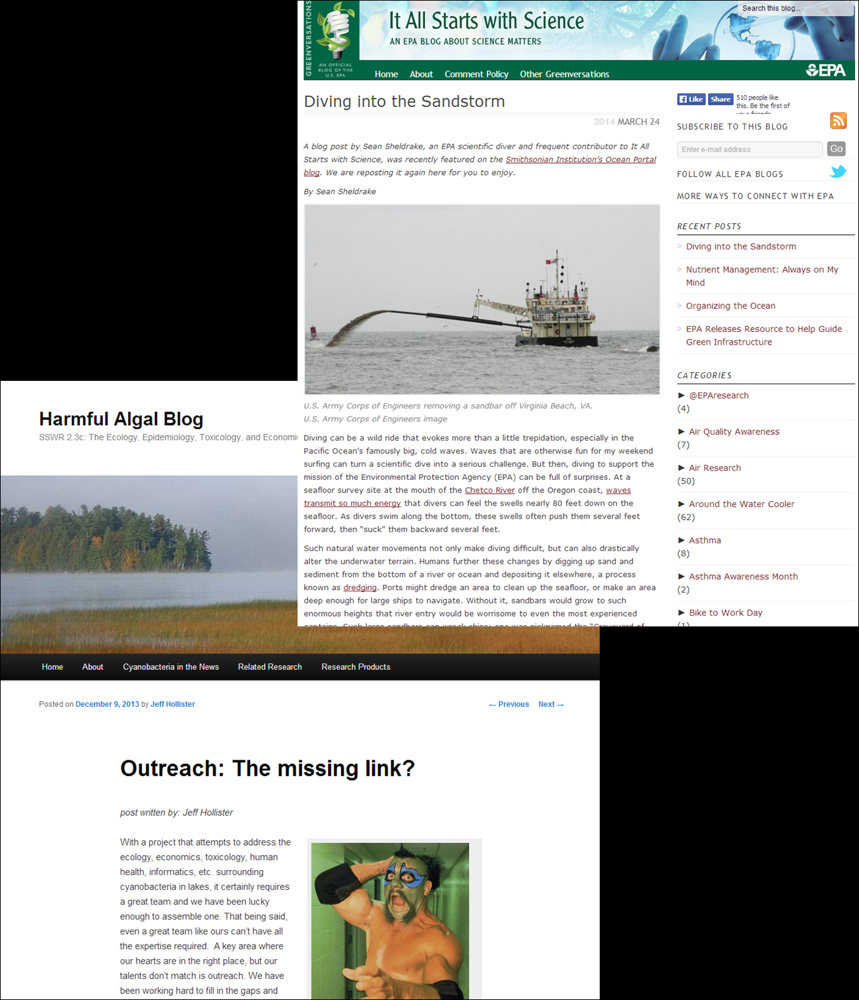
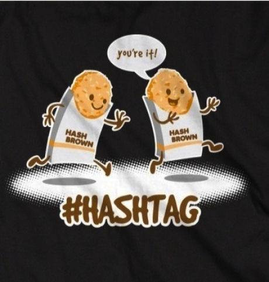

---
title       : Blogging, Social Media, and Science
subtitle    : EPA Edition
author      : Jeff Hollister
job         : US EPA, Research Ecologist
logo        : epa-seal.png
biglogo     : epa-seal.png
framework   : io2012        # {io2012, html5slides, shower, dzslides, ...}
highlighter : highlight.js  # {highlight.js, prettify, highlight}
hitheme     : tomorrow      # 
widgets     : []            # {mathjax, quiz, bootstrap}
mode        : selfcontained  # {standalone, draft, selfcontained}

--- &twocol w1:35% w2:60%

## Overview

***=left

1. Blogging
2. Twitter
3. Social Media
4. Online Presence
5. EPA Considerations
6. Does it matter?

***=right

source: indeterminate

<!-- Segue Blogging -->

--- .segue bg:url(assets/img/070104_booger-blogger.jpg)

<hgroup style="left: 30px; bottom: 65px;"><h2 style="font-size:300%;">Blogging</h2></hgroup>

source: <a href="http://netdna.webdesignerdepot.com/uploads/2009/03/070104_booger-blogger.jpg">Pirillio and Fitz</a>

--- 

## Blogging: Defined?

- blog: Truncation of the term "web log." 
- First used in mid to late 90's.  
- Web based platform for sharing information or discussion about any subject. 

source: <a href="https://books.google.com/ngrams/graph?content=blogging%2Cblog%2Cblogger&year_start=1990&year_end=2014&corpus=15&smoothing=7&share=&direct_url=t1%3B%2Cblogging%3B%2Cc0%3B.t1%3B%2Cblog%3B%2Cc0%3B.t1%3B%2Cblogger%3B%2Cc0">Google Ngram Viewer</a>

--- &twocol w1:48% w2:50%

## Blogging: Defined?

***=left

- Informal (e.g. [I Can Has Cheezburger](http://icanhas.cheezburger.com/lolcats))
- Professional (e.g. [FiveThirtyEight](http://fivethirtyeight.com/))
- Science (LOTS!)
 - Journals (e.g. [PLOS](http://blogs.plos.org/), [Scientific American](http://blogs.scientificamerican.com) )
 - Agencies (e.g. [EPA](http://blog.epa.gov/science/))
 - Academics (e.g. [Jeremy Fox: Dynamic Ecology](http://dynamicecology.wordpress.com/), [Simon Donner: Maribo](http://blogs.ubc.ca/maribo/))
 - Topical Aggregators (e.g. [R-bloggers](http://www.r-bloggers.com/))

***=right

--- &twocol w1:60% w2:40%

## Blogging: How?

***=left

### Technologies

- Wordpress (.com vs .org)
- Blogger
- Tumblr
- Jekyll/Octopress

***=right

### Styles

- Long Form (500+ words)
- Short Form (100 - 500 words)
- Visual (Short sentences, images)
- Gradient (crude > converstaional > formal (almost))

--- &twocol w1:45% w2:50%

## Blogging: Best Practices?

***=left

### Rules

>- Update frequency:
 - choose one and stick with it
 - but more frequent better than less
>- Comments:
 - Respond!
 - Moderate
 
>- Or ...
>- There are no rules

***=right

source: <a href="https://www.socialstrata.com/blog/community-guidelines-for-blogging">Mark Lynch</a>

--- &twocol w1:40% w2:60%

## Blogging and EPA

***=left

### Personal Blogs

Allowed, but...
>- Not at work
>- Careful with what gets posted
>- No PII, non-cleared info, etc.

***=right

source: <a href="http://imgs.xkcd.com/comics/dangers.png">XKCD</a>

--- &twocol w1:40% w2:60%

## Blogging: EPA "Official" Blogs

***=left

### Two options:

>- Internal Blogs
 - easy to set up
 - easy to run
 - no reviews of posts required
 - limited reach
 - [Harmful Algal Blog](https://intrablog.epa.gov/harmfulalgalblog/)
>- External Blogs
 - [Greenversations](http://www2.epa.gov/aboutepa/greenversations)
 - [It All Starts with Science](http://blog.epa.gov/science/)

***=right

<!-- Segue Twitter -->

--- .segue bg:url(assets/img/Assimilated.jpg)

<hgroup style="left: 20px; bottom:45px;"><h2 style="color:#559B6A; font-size:300%;">Twitter</h2></hgroup>

source: <a href="http://juice-marketing.com/blog/wp-content/uploads/2012/10/4441164310_3b574edf0d_o.jpg">Hill and Seiple</a>

--- &twocol w1:45% w2:50%

## Twitter: What?

***=left
- Micro-blogging site
- Limited to 140 Characters
- Purpose: Share what you want, but keep it short (my definition)
- Followers, Following, Tweets

***=right

### Risk Taking

--- &twocol w1:40% w2:60%

## Twitter: How?

***=left

- @jhollist
- #icanhazpdf or #rstats
- RT
- MT

***=right

source: <a href="https://twitpic.com/dgj4t6">indeterminate/twitpic</a>

--- &twocol w1:45% w2:55%

## Twitter: Why?

***=left
- Best bang for buck
- Low time investment
- Easier to mix personal/professional
 - @EPAresearch and @TheOnion
 - @PLOSLabs and @CharliePapazian

***=right

--- &twocol w1:40% w2:60%

## Twitter: EPAs take

***=left

### Personal Account
- Same rules as blogs
- nothing that is sensitive

### Official EPA Accounts
- Select few have access
- Use communications staff
 - EPA, ORD, NHEERL
 - etc.
- They welcome content!

***=right

source: <a href="http://www.valuablecontent.co.uk/wp-content/uploads/2012/05/How-not-to-use-Twitter-_-image-1023x530.jpg">Valuable Content</a>

<!-- Segue Social Networks -->

--- .segue bg:url(assets/img/MashableComicEarlySocialMedia_small.jpg)

<hgroup style="left: 600px; bottom: 600px;"><h2 style=" font-size:300%;">Social Networks</h2></hgroup>

source: <a href="http://rack.3.mshcdn.com/media/ZgkyMDEyLzA1LzIyLzEzXzU4XzU3XzY1MF9maWxlCnAJdGh1bWIJODUweDU5MD4KZQlqcGc/3e9eab41.jpg">Mashable Comics: Silverman and Essenpreis</a>

--- &twocol w1:60% w2:40%

## Social Networks: What and How?

***=left

1. Facebook
3. Google+
4. Linked-in
5. ResearchGate
6. Academia.edu

***=right

source: <a href="http://b-i.forbesimg.com/kenkrogue/files/2013/11/social-nurturing-with-linkedin-twitter-facebook-google-plus.jpg">Forbes</a>

--- &twocol w1:40% w2:60%

## Github: A special case?

***=left

### For code, but ...

>- really just text
 - manuscripts
 - websites
 - code
 - etc.
>- Social component

***=right

<!-- Segue Online Identity -->

--- .segue bg:url(assets/img/OnlineIdentitycartoon.jpg)

<hgroup style="left: 30px; bottom: 35px;"><h2 style="color:#559B6A; font-size:300%;">Online Identity</h2></hgroup>

source: <a href="http://perfectreputations.com/cartoon.jpg">Perfect Reputations</a>

--- &twocol w1:40% w2:60%

## Online Identity

***=left

1. Everything already mentioned
2. Personal Webpage
3. Google Scholar
4. ImpactStory
5. ORCID

***=right

> If you are not curating your online identity, 
> someone or something else is doing it for you.
> - Jarrett Byrnes, 
> <a href="http://www.imachordata.com/which-social-media-platform-should-i-use-for-science">i'm a chordata, urachordata</a>

--- &twocol w1:40% w2:55%

## Online Identity: ORCID

***=left
- Open Researcher and Contributor ID (ORCID)
- Increasingly adopted
- Individual identifier
- Accepted widely

***=right

--- &twocol w1:30% w2:70%

## Online Identity: Google Scholar 

***=left
- "My Citations" Page
- VERY easy
- Allows you to curate
- Research focused

***=right

--- &twocol w1:30% w2:70%

## Online Identity: Google Scholar 

***=left
- "My Citations" Page
- VERY easy
- Allows you to curate
- Research focused

***=right

--- &twocol w1:30% w2:70%

## Online Identity: Google Scholar 

***=left
- "My Citations" Page
- VERY easy
- Allows you to curate
- Research focused

***=right

--- &twocol w1:40% w2:60%

## Online Identity: ImpactStory

***=left
- Altmetrics
- Curate
 - Pubs
 - Presents
 - Code
 - Blogs
 - Tweets
- "I am more than my h-index"

***=right

<!-- Segue Does It Matter -->

--- .segue bg:url(assets/img/Hubspot-The-Rank-Nazi.jpg)

<hgroup style="left: 30px; bottom: 600px;"><h2 style="color:#559B6A; font-size:300%;">Does It Matter?</h2></hgroup>

source: <a href="http://juice-marketing.com/blog/wp-content/uploads/2012/10/Hubspot-The-Rank-Nazi.jpg">Hill and Shah</a>

--- &twocol w1:40% w2:60%

## Does it Matter: What others think

***=left

### Great Articles

- Social Media: [Jarett Byrnes](http://www.imachordata.com/which-social-media-platform-should-i-use-for-science/)
- Twitter: [Meg Duffy](http://dynamicecology.wordpress.com/2012/09/13/why-i-use-twitter/)
- Blogging: [Fox, (2012), Ideas in Ecology and Evolution](http://library.queensu.ca/ojs/index.php/IEE/article/view/4457)
- Twitter: [Darling et al, (2013), Ideas in Ecology and Evolution](http://library.queensu.ca/ojs/index.php/IEE/article/view/4625)
- Blogging: [Bik and Goldstein, (2013) PLOS Biology](http://www.plosbiology.org/article/info%3Adoi%2F10.1371%2Fjournal.pbio.1001535)

***=right

source: <a href="http://www.plosbiology.org/article/info%3Adoi%2F10.1371%2Fjournal.pbio.1001535">Bik and Goldstein (2013)</a>

--- &twocol w1:40% w2:60%

## Does it Matter: My Experience

***=left

### A Few Examples
>- Finding papers 
>- New Collaborations
 - ROpenSci
 - Software Carpentry
 - Boston MOs
 - MIT Sensable City Lab

***=right

source: <a href="http://www.docave.com/AvePointBlog/Lists/Photos/Dilbert.JPG">Scott Adams and DocAve</a>

--- &twocol w1:40% w2:60%

## Does it Matter: My Experience

***=left

### A Few Examples
- And a T-Shirt!

***=right

--- &twocol w1:40% w2:60%

## Does it Matter: Real Data 1

***=left
- Increased Online Activity
 - Twitter
 - Blog
 - Personal Site
- Nothing Targeted
 - [Hollister et al (2011) PLOS One](http://www.plosone.org/article/info%3Adoi%2F10.1371%2Fjournal.pone.0025764)

***=right

--- &twocol w1:40% w2:60%

## Does it Matter: Real Data 2

***=left
- Targeted Blog Post PLOS One
 - [Milstead et al (2013)](http://www.plosone.org/article/info%3Adoi%2F10.1371%2Fjournal.pone.0081457)
 - [EPA: It All Starts with Science](http://blog.epa.gov/science/2013/12/sparrows-lakes-and-nutrients/)
 - [Personal Blog](http://landeco2point0.wordpress.com/2013/12/03/sparrow-lake-volume-field-data-plos-one-paper/)
- Tweets
 - @EPAresearch
 - @jhollist

***=right

--- &twocol w1:30% w2:70%

## My Recomendations

***=left

***=right
### In Order:

1. Google Shcolar
2. ORCID
3. Twitter
4. **if you code:** GitHub
4. Read and Comment On Blogs
5. Write posts for other Blogs (e.g. EPA's It all Starts with Science)
6. Start your Own Blog
7. Personal Page
8. Whatever Social Networking sites you want (YMMV)

--- &twocol w1:30% w2:70%

## Things to remember

***=left

***=right
### Short List:

1. You get out what you put in
2. The internet lives forever (until proven otherwise)
3. You exist online, even if you think you don't

--- &twocol w1:25%% w2:70%

## Questions

***=left
- Any talk about social media must have cute pictures of children or pets.  It's a law

***=right

